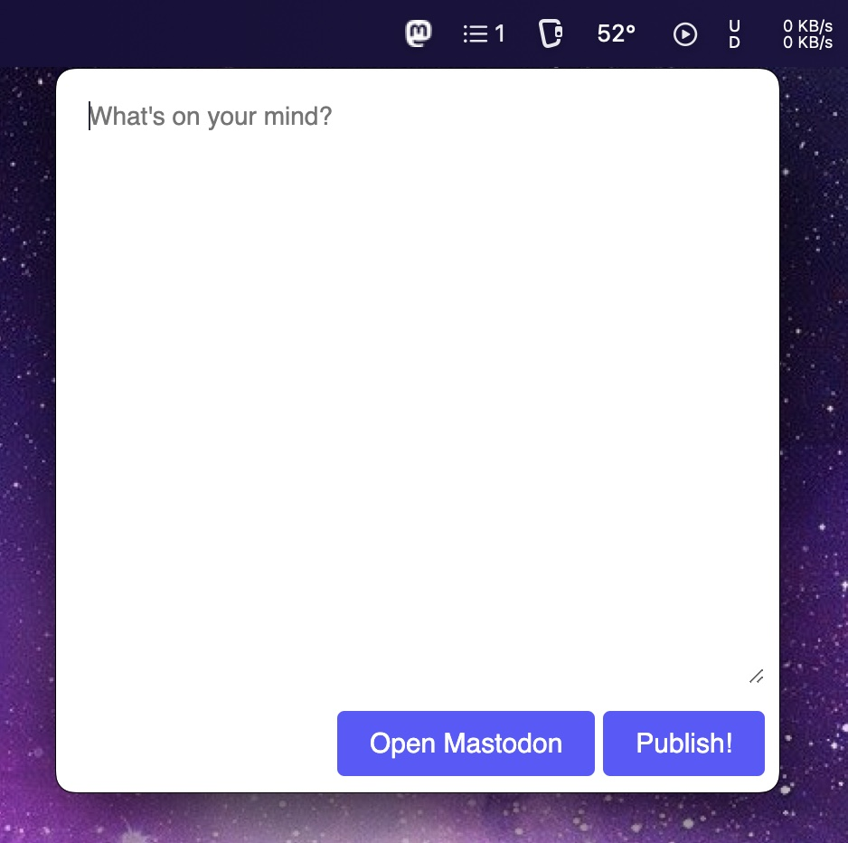

# Menudon



Send toots from your menubar. 🐘

## Setup

Put your Mastodon credentials in `~/.config/menudon/config.json`:

```json
{
  "instance": "https://mastodon.social",
  "username": "yourusername",
  "token": "yourtoken"
}
```

You can get your token from the [Mastodon API](https://mastodon.social/settings/applications).

Build and run the app:

```bash
$ npm install
$ npm start
```

Somebody needs to package this up please.

## Usage

Open the menubar app and write a toot.

## Packaging

```bash
$ npm run build
```

## Why?

Lazyness (and billionaires going berserk on Twitter).

## License

MIT

App icon by [Iconduck](https://iconduck.com/icons/1891/mastodon).
